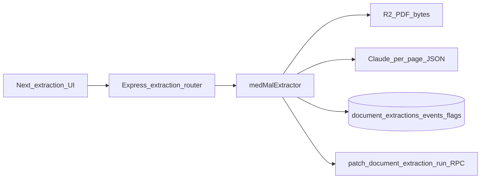

# Extraction pipeline: next steps

## Skills to apply during execution

When implementing or validating this plan, **read and follow** these skills (do not skip verification or security checks they require):

| Skill | Path | When | What to do |
|-------|------|------|------------|
| Supabase | `~/.cursor/plugins/cache/cursor-public/supabase/release_v0.1.4/skills/supabase/SKILL.md` | Any migration, RPC, RLS, or MCP-driven DB change | Prefer MCP `search_docs` or current docs for behavior you are unsure about; **verify with a concrete test query** after DDL/RPC changes; run **`get_advisors`** (MCP) or `supabase db advisors` after substantive DB work; complete the skill’s **security checklist** for RLS/views/functions (especially: service role never in clients; beware **UPDATE requires SELECT** under RLS if you expand policies); use MCP **`execute_sql`** for ad-hoc checks on the linked project rather than guessing. Note: repo ships hand-authored files under [`backend/migrations/`](../../backend/migrations/)—when generating *new* Supabase-managed history, align with **`supabase migration new`** workflow from the skill so filenames stay consistent with your branching story. |
| supabase-postgres-best-practices | `~/.cursor/plugins/cache/cursor-public/supabase/release_v0.1.4/skills/supabase-postgres-best-practices/SKILL.md` | New indexes, hot paths listing events/runs, or RPC changes | Skim **Security & RLS** and **Query performance** rule categories before adding indexes or widening policies; avoid N+1 access patterns on extraction reads. |
| Vitest | `~/.agents/skills/vitest/SKILL.md` | New unit/integration tests under `backend/` | Use existing [`vitest.config.ts`](../../backend/vitest.config.ts) + `npm test`; prefer **`vi.mock`** for Supabase client when testing route handlers; set **`environment: 'node'`** for Express/supertest-style tests; use describe grouping and mocks per Vitest mocking reference. |

Optional hygiene (repository conventions): after a significant milestone, update [`.remember/`](../../.remember/) or [`AGENTS.md`](../../AGENTS.md) per workspace prefs—only if this batch constitutes a milestone worth preserving.

---

## Where things stand

**Implemented in code** (mostly untracked / modified per git):

- **DB:** [`backend/migrations/0002_document_extraction.sql`](../../backend/migrations/0002_document_extraction.sql) (tables `document_extractions`, `document_events`, `document_red_flags` + RLS), [`backend/migrations/0003_patch_document_extraction_run.sql`](../../backend/migrations/0003_patch_document_extraction_run.sql) for `patch_document_extraction_run`; mirrored in [`backend/schema.sql`](../../backend/schema.sql).
- **API:** [`backend/src/routes/extraction.ts`](../../backend/src/routes/extraction.ts) — `POST /:documentId/run` (409 on concurrent run), `GET …/status`, `GET …/events` and `/red-flags` (peer-review filtered). Mounted with a dedicated limiter in [`backend/src/index.ts`](../../backend/src/index.ts).
- **Orchestrator:** [`backend/src/lib/extraction/medMalExtractor.ts`](../../backend/src/lib/extraction/medMalExtractor.ts) — PDF load, peer-review prescan halt, per-page Claude JSON, events insert, deterministic red flags, RPC status patches.
- **Primitives:** [`pdfRegions.ts`](../../backend/src/lib/extraction/pdfRegions.ts) — text layer only (**no raster / vision fallback**).
- **UI + client:** extraction page, `mikeApi` helpers, `ProjectPage` link.
- **Chat:** extraction-backed tools in [`chatTools.ts`](../../backend/src/lib/chatTools.ts).
- **Tests:** Vitest unit tests for event log / peer-review markers only; **no HTTP extraction route tests**.

---

## Near-term ship checklist

1. **Supabase (skill-guided):** Apply `0002` then `0003`; verify RPC with `execute_sql` or a minimal Node call; run **advisors**; fix any security/index warnings tied to new tables.
2. **Backend:** `npm run build` and `npm test` in `backend/`; manual `POST …/run` + poll `GET …/status`.
3. **Frontend:** Smoke `/projects/:id/extraction` on a `med-mal-case` project.
4. **Commits:** Multiple `feat(extraction): …` commits per roadmap.
5. **Tracker:** Refresh [`.cursor/plans/phase_2_extraction_pipeline_f7bd0030.plan.md`](phase_2_extraction_pipeline_f7bd0030.plan.md) checklist vs reality.

---

## Roadmap deltas

| Gap | Follow-up |
|-----|-----------|
| Zero text layer / scanned PDFs | Raster + vision path in `pdfRegions` / storage + Claude multimodal slice. |
| Gemini behind flag | Defer unless required; mirror JSON schema + tests when added. |
| Atomic events + flags | Optional single transaction if partial reads become an issue. |

---

## Quality

- **HTTP negatives (Vitest + supertest optional):** wrong-user / wrong-doc → 403/404.
- **CI:** Add backend `npm test` + `npm run build` when CI exists.

---

## Deployment

`setImmediate` after `202` is fragile on serverless; move to a **durable queue** when hosting target demands it ([`AGENTS.md`](../../AGENTS.md)).
