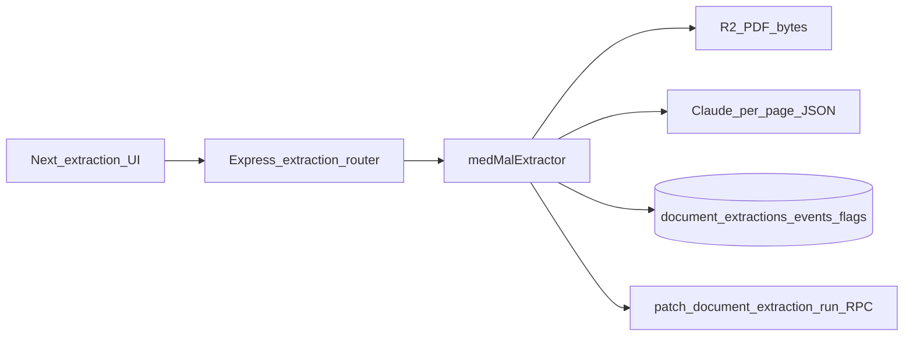

# Extraction pipeline: next steps

## Skills to apply during execution

When implementing or validating this plan, **read and follow** these skills (do not skip verification or security checks they require):

| Skill | Path | When | What to do |
|-------|------|------|------------|
| Supabase | `~/.cursor/plugins/cache/cursor-public/supabase/release_v0.1.4/skills/supabase/SKILL.md` | Any migration, RPC, RLS, or MCP-driven DB change | Prefer MCP `search_docs` or current docs for behavior you are unsure about; **verify with a concrete test query** after DDL/RPC changes; run **`get_advisors`** (MCP) or `supabase db advisors` after substantive DB work; complete the skill’s **security checklist** for RLS/views/functions (especially: service role never in clients; beware **UPDATE requires SELECT** under RLS if you expand policies); use MCP **`execute_sql`** for ad-hoc checks on the linked project rather than guessing. Note: repo ships hand-authored files under [`backend/migrations/`](../../backend/migrations/)—when generating *new* Supabase-managed history, align with **`supabase migration new`** workflow from the skill so filenames stay consistent with your branching story. |
| supabase-postgres-best-practices | `~/.cursor/plugins/cache/cursor-public/supabase/release_v0.1.4/skills/supabase-postgres-best-practices/SKILL.md` | New indexes, hot paths listing events/runs, or RPC changes | Skim **Security & RLS** and **Query performance** rule categories before adding indexes or widening policies; avoid N+1 access patterns on extraction reads. |
| Vitest | `~/.agents/skills/vitest/SKILL.md` | New unit/integration tests under `backend/` | Use existing [`vitest.config.ts`](../../backend/vitest.config.ts) + `npm test`; prefer **`vi.mock`** for Supabase client when testing route handlers; set **`environment: 'node'`** for Express/supertest-style tests; use describe grouping and mocks per Vitest mocking reference. |

Optional hygiene (repository conventions): after a significant milestone, update [`.remember/`](../../.remember/) or [`AGENTS.md`](../../AGENTS.md) per workspace prefs—only if this batch constitutes a milestone worth preserving.

---

## Where things stand

**Shipped on `feat/extraction-phase2`** (PR #2 OPEN on rmerk/mike):

- **DB:** [`0002_document_extraction.sql`](../../backend/migrations/0002_document_extraction.sql), [`0003_patch_document_extraction_run.sql`](../../backend/migrations/0003_patch_document_extraction_run.sql), [`0004_extraction_async_jobs.sql`](../../backend/migrations/0004_extraction_async_jobs.sql); mirrored in [`backend/schema.sql`](../../backend/schema.sql). Applied to `qkfcrsrtualqdmqqexpf`.
- **API:** [`backend/src/routes/extraction.ts`](../../backend/src/routes/extraction.ts) — `POST /:documentId/run` (409 on concurrent), `GET …/status`, `GET …/events` and `/red-flags` (peer-review filtered). Dedicated `extractionLimiter` in [`backend/src/index.ts`](../../backend/src/index.ts).
- **Orchestrator:** [`backend/src/lib/extraction/medMalExtractor.ts`](../../backend/src/lib/extraction/medMalExtractor.ts) — PDF load, **text-layer** peer-review prescan halt, per-page Claude JSON, events insert, deterministic red flags, RPC status patches.
- **Primitives:** [`pdfRegions.ts`](../../backend/src/lib/extraction/pdfRegions.ts) exports `renderPageToPngBuffer` (2048px edge cap, OOM-safe downscale), `pageNeedsVisionRaster`, `clampBboxToPage`. Vision path active in the per-page loop for empty-text pages.
- **Vision:** [`completeClaudeMedMalExtractionPage`](../../backend/src/lib/llm/claude.ts) takes optional `visionPngBase64`; raster cached at `extractionPageRasterKey(userId, documentId, runId, pageNum)` per run.
- **Queue worker:** `EXTRACTION_ASYNC_MODE=queue` + [`extraction_async_jobs`](../../backend/migrations/0004_extraction_async_jobs.sql) + claimed-by-instance worker (durable behind `EXTRACTION_JOB_POLL_MS`).
- **UI + client:** extraction page with bbox highlighting, `mikeApi` helpers, `ProjectPage` link.
- **Chat:** extraction-backed tools in [`chatTools.ts`](../../backend/src/lib/chatTools.ts); med-mal chat prefers event-log retrieval when extraction is complete.
- **Tests:** Vitest unit + supertest HTTP coverage (peer-review gate, auth POST/GET, worker, event log, peer-review markers, route access). 

**Compliance gap (open):** the prescan at [`medMalExtractor.ts:249-254`](../../backend/src/lib/extraction/medMalExtractor.ts) reads only the text layer. Scanned pages with §145.64 marker phrases visible only in the raster pass the gate silently — see todo `vision-peer-review-prescan`.

---

## Pre-merge work units (blocking PR #2)

1. **§145.64 vision-page peer-review prescan** (compliance critical) — new [`peerReviewVisionPrescan.ts`](../../backend/src/lib/extraction/peerReviewVisionPrescan.ts) renders empty-text pages, asks Claude for `{has_peer_review_markers, matched_phrase}` (canonical [`PEER_REVIEW_MARKERS`](../../backend/src/lib/extraction/peerReviewMarkers.ts) embedded in the prompt). Cache rasters in a `Map<pageNum, rasterKey>` so the main loop reuses them; lift per-page deletion to an after-loop sweep. Batch up to 4 pages per Claude call.
2. **0005 migration** — `create index if not exists extraction_async_jobs_document_id_idx on public.extraction_async_jobs (document_id);` Mirror in [`schema.sql`](../../backend/schema.sql); apply via `mcp__supabase__apply_migration` on `qkfcrsrtualqdmqqexpf`; verify with `get_advisors --type performance`.
3. **Malformed-PDF crash smoke** — Vitest spec asserting `loadPdfFromBuffer` throws and `executeMedMalExtraction` surfaces a `Failed to open PDF:` error sliced to ≤200 chars.
4. **Backend CI** — [`.github/workflows/backend-ci.yml`](../../.github/workflows/backend-ci.yml) — Node 22, `npm ci → npm run build → npm test`, scoped to `backend/**` path filter.

---

## Out of scope this batch (Phase 3+)

- Gemini multimodal extraction (still behind unimplemented `EXTRACTION_VISION_PROVIDER` flag).
- Atomic events+flags single transaction (deferred unless partial-read issues surface).
- §144.293 mental-health redaction-by-default automation; Rule 408 narrative prefix automation.
- Phase 3 — templates ↔ extraction integration (tabular reviews populate from `document_events`).
- Phase 4 — `projects.key_dates jsonb` + deadline-tracking widget.
