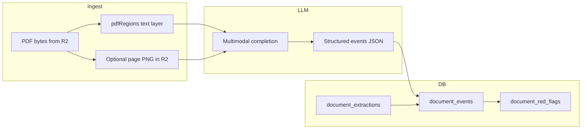

# Phase 2: Med-mal extraction pipeline

## Scope and sequencing

Work should land as **multiple focused commits** prefixed `feat(extraction): …` (per [docs/PLAN_med_mal_roadmap.md](docs/PLAN_med_mal_roadmap.md)), roughly in dependency order: **schema → PDF/bbox + multimodal → persistence + rules → routes → frontend → chat integration**.

The canonical DDL and file list live in [docs/PLAN_med_mal_extraction_pipeline.md](docs/PLAN_med_mal_extraction_pipeline.md) (§Schema change, §Files to be modified). **Appendix (this file)** duplicates v1 red-flag `rule_id` names and §145.64 marker phrases for offline reading; **authoritative** marker matching still lives in **typed code constants** with tests (paths: `[INSERT: constants module under backend/src/lib/extraction/]`, `[INSERT: test file path]`).

## Canonical naming (roadmap → repo)

| Roadmap / alternate | Canonical in this repo |
|---------------------|-------------------------|
| `backend/src/lib/extraction/pdfPages.ts` | [backend/src/lib/extraction/pdfRegions.ts](backend/src/lib/extraction/pdfRegions.ts) |
| `backend/src/lib/extraction/redFlagRules.ts` | `redFlags.ts` (per extraction pipeline doc) |
| `backend/src/lib/llm/multimodal.ts` (roadmap “hidden dependency”) | Extend [backend/src/lib/llm/types.ts](backend/src/lib/llm/types.ts) and provider files ([backend/src/lib/llm/claude.ts](backend/src/lib/llm/claude.ts) / [backend/src/lib/llm/gemini.ts](backend/src/lib/llm/gemini.ts)); optional later `multimodal.ts` facade |
| R2 raster path `extractions/{userId}/{docId}/pages/{n}.png` (roadmap) | One helper under [backend/src/lib/storage.ts](backend/src/lib/storage.ts); namespace chosen once and documented in §2 |

## 1. Database migration and `schema.sql`

- Add [backend/migrations/0002_document_extraction.sql](backend/migrations/0002_document_extraction.sql) (next free id after `0001`) with the three tables from the companion plan: `document_events`, `document_red_flags`, `document_extractions`.
- **Version pinning (data correctness):** add `document_version_id uuid not null references public.document_versions(id)` on `document_extractions` **if** the companion DDL snippet omits it—verify [docs/PLAN_med_mal_extraction_pipeline.md](docs/PLAN_med_mal_extraction_pipeline.md) before implementing; orchestrator must set this to the resolved active version at `POST /run` so a mid-run upload cannot mix PDFs.
- **Integrity:** add `foreign key (extraction_run_id) references document_extractions(id)` on `document_events` (the companion snippet may omit the FK inline).
- **Indexes:** keep the companion plan’s indexes; add `(document_id, extraction_run_id)` if useful for listing runs.
- Mirror the same DDL into [backend/schema.sql](backend/schema.sql) so fresh installs match prod (same pattern as `template_id`).
- **RLS:** enable RLS on all three tables; policies should mirror [backend/schema.sql](backend/schema.sql) `document_versions` style (`exists (select 1 from documents d where d.id = document_id …)` with `current_user_id_text()` / `project_is_accessible` for selects, and **owner-only** writes for inserts/updates/deletes where appropriate).

### RLS and service-role clients

- **Postgres RLS does not apply** to the Supabase **service-role** key. Any server path using `createServerSupabase()` with service role **must not** assume RLS protects tenants.
- **Route-layer invariants:** every `SELECT` / `INSERT` / `UPDATE` / `DELETE` on `document_events`, `document_red_flags`, and `document_extractions` goes through code that **re-asserts** document/project access (reuse [backend/src/lib/access.ts](backend/src/lib/access.ts) patterns used elsewhere). No ad-hoc queries that skip the check.

### Peer-review rows (`privacy_class = peer_review_145_64`)

- **Default SELECT (RLS):** exclude these rows for normal application roles via policy `using` (same intent as companion plan).
- **Who may read:** default **no human-facing reader** through normal app queries. Optional **break-glass** (dedicated DB role + narrow `SECURITY DEFINER` RPC for audit, or org policy) is a **product/legal decision** — if undecided, ship default deny only; see **Still OPEN** below.
- **Defense in depth:** `GET .../events` and the extraction UI **also** filter out `peer_review_145_64` even if RLS were misconfigured.

- Apply via Supabase MCP `apply_migration` to the same environment workflow documented in `0001` ([backend/migrations/0001_projects_template_id.sql](backend/migrations/0001_projects_template_id.sql)) and update [CLAUDE.md](CLAUDE.md) if migration numbering or free-tier branching notes change.

## 2. PDF bbox primitive (`pdfRegions`)

- New module [backend/src/lib/extraction/pdfRegions.ts](backend/src/lib/extraction/pdfRegions.ts) as specified: sibling to `extractPdfText` in [backend/src/lib/chatTools.ts](backend/src/lib/chatTools.ts), using `pdfjs-dist/legacy/build/pdf.mjs` the same way, but preserving per-glyph `transform` to expose `getPageItems(pdf, pageNum) → { text, x, y, w, h }[]` (**pdf.js user-space** units).
- **Fallback path (v1):** if a page yields **zero** text items, optionally rasterize that page (Node canvas or `pdf-to-img` / similar—pick what fits the existing Node + Workers constraints) and upload to R2. **Lifecycle:** create rasters only when needed; keys must be **idempotent** across re-runs (include `document_version_id` and/or `extraction_run_id` in the key path so a new run never reads stale PNGs). **Failed run:** best-effort delete of raster objects for that run `[INSERT: sync delete vs async sweeper note]`; document which approach ships. **OOM / size:** cap max raster width/height `[INSERT: px]` and downscale before encode (one policy sentence in implementation).
- Align keys with [backend/src/lib/storage.ts](backend/src/lib/storage.ts) (helper next to `pdfStorageKey`, e.g. `extractionPageRasterKey(...)`); converge roadmap path `extractions/...` with whatever namespace `pdfStorageKey` uses—**one** convention.

## 3. Multimodal LLM layer

- [backend/src/lib/llm/index.ts](backend/src/lib/llm/index.ts) and [backend/src/lib/llm/types.ts](backend/src/lib/llm/types.ts) currently expose **text-only** chat/complete paths. Extend types with a narrow “extraction message” shape: system + user parts where user parts can be `{ type: 'text' }` and `{ type: 'image' | 'pdf', base64, mediaType }` (or Anthropic’s `document`/`image` blocks).
- Implement **Claude first** in [backend/src/lib/llm/claude.ts](backend/src/lib/llm/claude.ts) (non-streaming JSON completion is enough for v1 extraction to avoid fighting the tool loop). Export something like `completeClaudeMultimodal(...)` consumed only by extraction.

### Provider selection (v1)

- **Default for production:** **Claude-only** until Gemini multimodal extraction is implemented and covered by the same JSON schema tests.
- **Gemini:** ship behind an env flag such as **`EXTRACTION_VISION_PROVIDER`** (exact name implementor’s choice); when disabled or model not vision-capable, return **`503` or `422`** with an explicit message—**no** silent fallback to text-only on pages that require images/raster.
- When Gemini is enabled: **same** structured JSON schema as Claude (parity expectation).
- Keep extraction on **server-only** code paths; after changes, run the frontend build smoke called out in the roadmap (Cloudflare/OpenNext compatibility).

### LLM output robustness (orchestrator contract)

Applies inside [backend/src/lib/extraction/medMalExtractor.ts](backend/src/lib/extraction/medMalExtractor.ts) (and any helper it calls):

| Failure mode | Behavior (v1 defaults) |
|--------------|-------------------------|
| Invalid JSON / schema mismatch | Up to `[INSERT: N]` repair retries (strategy per implementor); then set `document_extractions.status='failed'`, `error` summarizing parse failure. **No** insert for that page’s events until validation passes. |
| Empty model output | Same retry cap as parse failures per page; **default run policy:** after repeated empty responses for a page, fail the **whole** run (`failed` + `error`) `[INSERT: repeat count threshold]`. |
| Provider HTTP / rate-limit errors | Exponential backoff, total cap `[INSERT]`; then `failed` + `error`. |
| Token limit mid-document | Stop loop; `failed` + `error` noting last attempted page; `pages_complete` reflects last **successfully** committed page. |

## 4. Persistence and citation enforcement

- New [backend/src/lib/extraction/eventLog.ts](backend/src/lib/extraction/eventLog.ts): insert batches of events; **reject** any row missing `source_page` or valid `source_bbox` object before insert (companion plan §Citation enforcement + unit test).
- Wrap Supabase access via existing [backend/src/lib/supabase.ts](backend/src/lib/supabase.ts) `createServerSupabase()` (**service role** after `requireAuth` + **mandatory** route-layer access checks—see §RLS and service-role clients).

## 5. Red-flag library and MN defenses

- New [backend/src/lib/extraction/redFlags.ts](backend/src/lib/extraction/redFlags.ts): six deterministic rules over `document_events` — `rule_id` values in **Appendix** — plus the **`peer_review_detected`** sentinel. For **`peer_review_detected`**: `supporting_event_ids = []` (zero `document_events` rows exist); summary text carries matching page numbers per companion plan.
- **§145.64 hard-refuse:** before the per-page multimodal loop, scan extracted text (pdfjs, case-insensitive) against **code constants** (same phrases as Appendix); on hit, insert red-flag row, set extraction terminal state with explanatory `error`, **zero events**, stop.
- **Transaction boundary:** after all pages, wrap **`INSERT` into `document_red_flags`** (all flags for the run) **and** `UPDATE document_extractions` to `complete` in a **single DB transaction**. If this throws, follow up with `failed` + `error`; **events from earlier per-page commits may already exist** — UI must show **failed** and must not imply a “clean complete” (see **Still OPEN** for optional compensating delete).
- **§144.293 / Rule 408 / 26(b)(3):** v1 can implement **mental-health redaction-by-default** and **Rule 408 narrative prefix** in the orchestrator; work-product opt-in and explicit peer-review “toggle” can be stubbed with constants + TODO if UI toggles are not ready—document the gap in the PR body.

## 6. Orchestrator (`medMalExtractor`)

- New [backend/src/lib/extraction/medMalExtractor.ts](backend/src/lib/extraction/medMalExtractor.ts): at **`POST /run`**, resolve the **active** `document_versions` row for the PDF (follow [backend/src/routes/projects.ts](backend/src/routes/projects.ts) / [backend/src/lib/documentVersions.ts](backend/src/lib/documentVersions.ts)), persist **`document_version_id`** on the new `document_extractions` row, fetch bytes from R2 for **that version only**, transition `pending` → `running`, loop pages, update `pages_complete`, call multimodal completion with a **fixed JSON schema**, validated inserts per **LLM output robustness**, then run `redFlags` and persist flags per §5 transaction.
- **BBox validation:** clamp/normalize LLM bboxes to page dimensions from pdfjs viewport before persist (mitigate off-page hallucination per roadmap).
- **Async execution:** no job queue in v1; use **fire-and-forget** after auth + row creation, with errors on `document_extractions.error`. Detailed edge behavior: **§Async execution and edge paths (v1)** below.
- **Logging:** log only ids/progress; **do not** log raw page text, **base64 lengths**, image dimensions, or raw provider **error bodies** that may echo model-generated document text.

### Async execution and edge paths (v1)

| Topic | v1 behavior |
|--------|-------------|
| Concurrent `POST /run` same `documentId` | **Per-`documentId` advisory lock** (or equivalent). Second request: **`409 Conflict`** with stable machine-readable error. |
| Crash mid-loop | `pages_complete` / `pages_total` / `status` / `error` reflect reality; re-run creates a **new** `document_extractions` row — **never append** events to a prior run. |
| Empty PDF (`pages_total = 0`) | Fail fast: `failed` + clear `error`. |
| Encrypted / password PDF | Detect via pdfjs; fail fast with user-facing message. |

## 7. HTTP API and rate limits

- New [backend/src/routes/extraction.ts](backend/src/routes/extraction.ts) with `requireAuth` and **document access** checks on **every** handler touching extraction tables (reuse [backend/src/lib/access.ts](backend/src/lib/access.ts) patterns).
- Endpoints: `POST /extraction/:documentId/run`, `GET /extraction/:documentId/events`, `GET /extraction/:documentId/red-flags`, `GET /extraction/:documentId/status`.
- Register router in [backend/src/index.ts](backend/src/index.ts); add **`extractionLimiter`** as a **separate** limiter from `chatCreateLimiter` — extraction is higher cost than chat create: `[INSERT: requests per time window]` and **per-user max concurrent extraction runs** `[INSERT: number]` (placeholders until load-tested).
- **GET `/status` (polling v1):** response includes monotonic **`seq`** (integer increment on each progress/status mutation) and/or **`updated_at`**, plus `status`, `pages_complete`, `pages_total`. Client: if `(seq, updated_at)` unchanged for `[INSERT: client poll interval ms]`, treat UI as stale; on transition to `complete`/`failed`, refetch events/red-flags lists.
- **SSE:** optional v1—either mimic tabular’s streaming style ([frontend/src/app/lib/mikeApi.ts](frontend/src/app/lib/mikeApi.ts) `streamTabularGeneration`) or ship polling first; polling contract above still applies when SSE is absent.

## 8. Frontend extraction view

### Bbox / viewport contract

- Server and `pdfRegions` use **pdf.js user-space** coordinates for `{ x, y, w, h }` (consistent with `getPageItems`).
- Client: map bbox through the **current page viewport transform** (scale, rotation, CSS offset) inside [frontend/src/app/components/shared/DocView.tsx](frontend/src/app/components/shared/DocView.tsx). Implement via a sibling helper (e.g. `highlightBbox.ts`) or an explicit **bbox mode** on [frontend/src/app/components/shared/highlightQuote.ts](frontend/src/app/components/shared/highlightQuote.ts); **recompute overlay on zoom, rotation, and page change**.

### UI wiring

- Add API helpers to [frontend/src/app/lib/mikeApi.ts](frontend/src/app/lib/mikeApi.ts): `runExtraction`, `getExtractionStatus`, `listDocumentEvents`, `listRedFlags` (+ optional stream helper).
- New page [frontend/src/app/(pages)/projects/[id]/extraction/page.tsx](frontend/src/app/(pages)/projects/[id]/extraction/page.tsx): left DocView, right timeline + red flags; clicking an item jumps page and applies bbox highlight per contract above.
- Add navigation entry from [frontend/src/app/components/projects/ProjectPage.tsx](frontend/src/app/components/projects/ProjectPage.tsx) (e.g. link near Documents or per-document “Extract” when `file_type` is PDF)—must be discoverable.

## 9. Chat integration (same phase, separate commit if large)

- Extend [backend/src/lib/chatTools.ts](backend/src/lib/chatTools.ts) with tools: `read_event_log`, `find_events_in_range`, `read_pdf_page_region` as specified in the companion plan.
- Update [backend/src/routes/projectChat.ts](backend/src/routes/projectChat.ts) / `buildProjectDocContext` path so med-mal projects **prefer** event-log grounded retrieval when a completed extraction exists.

## 10. Verification

- **Unit test:** citation enforcement rejects bad rows (missing page/bbox) — `[INSERT: test file path]` once test stack exists for backend.
- **Mandatory negative access test:** authenticated request as **user B** against **user A’s** `documentId` or a document in an **inaccessible** project, hitting the **same HTTP extraction routes** the app uses — expect **403** or **404** (not 200, not 500). Track as todo `extraction-negative-access-test`; file path `[INSERT: test file path]`.
- **RLS:** still valuable for **future** direct client reads; server routes remain the primary enforcement while using service role.
- Manual: run against a small PDF slice (dozens of pages) before a full 3K Epic run.
- Update `.remember` session files locally after milestones (per project convention).

## Out of scope for this phase

- Phase 3 tabular integration and Phase 4 `key_dates` widget ([docs/PLAN_med_mal_roadmap.md](docs/PLAN_med_mal_roadmap.md)).
- **Full** adversarial PDF harness (companion plan §Verification item 6)—deferred; keep hooks for future tests.
- **Minimal crash smoke:** repo has **no** verified existing pattern for malformed-PDF automated tests (`UNKNOWN`). When a harness exists, add a **timeboxed** malformed-xref (or similar) crash smoke — todo `malformed-pdf-smoke`.

---

## Appendix: v1 red-flag `rule_id` names

Six deterministic filters over `document_events` (companion plan table):

1. `delayed_dx`
2. `med_error`
3. `retained_foreign_object`
4. `failure_to_monitor`
5. `informed_consent_gap`
6. `temporal_anchor_causation`

**Sentinel (not one of the six):** `peer_review_detected` — emitted only on §145.64 halt; **`supporting_event_ids = []`**.

## Appendix: §145.64 marker phrases (offline reference)

Match **case-insensitively** in implementation. Companion doc uses two slightly different wordings in different sections; **normalize into one deduplicated constant array** in code (and tests) covering at least:

- `peer review`
- `peer-review committee`
- `QI committee`
- `quality improvement`
- `quality improvement review`
- `root cause analysis`
- `RCA report`
- `morbidity and mortality`
- `morbidity and mortality conference`
- `M&M conference`
- `sentinel event review`

**Authoritative implementation:** typed export (e.g. `PEER_REVIEW_MARKERS`) in `[INSERT: path under backend/src/lib/extraction/]` plus unit tests asserting length and case-insensitive matching — test file `[INSERT: test file path]`.

---

## Resolved in plan

- Naming drift (`pdfPages` / `redFlagRules` / `multimodal.ts` vs canonical files) via naming table.
- Service-role bypass of RLS + mandatory route-layer access checklist.
- Peer-review default deny + API/UI defense in depth; break-glass deferred to OPEN if needed.
- Concurrent runs (`409`), crash/empty/encrypted PDF paths, re-run = new extraction row (no append).
- LLM failure modes (parse, empty, provider, token limit) with placeholders for numeric caps.
- v1 production default **Claude-only**; Gemini behind flag with explicit HTTP errors when unavailable.
- Raster R2 lifecycle (when created, idempotent keys, failed-run cleanup placeholder, raster size cap placeholder).
- `extractionLimiter` intent separate from chat with numeric placeholders.
- Mandatory negative HTTP access test requirement.
- DocView bbox pipeline (user-space → viewport transform; recompute on zoom/rotation/page).
- `document_version_id` pinning at run start (migration note if companion DDL omits column).
- `peer_review_detected` uses empty `supporting_event_ids`; red-flag + `complete` status in one transaction; honest partial events on failure (compensating delete = OPEN).
- Status polling contract (`seq` / `updated_at`).
- Logging extended to forbid dimensions/base64-length/provider error body leakage.
- Appendix lists six rules + sentinel and marker phrases; code constants + tests are authoritative for matching.

## Still OPEN (needs human decision)

1. **Break-glass read path** for `peer_review_145_64` audit (dedicated role + `SECURITY DEFINER` RPC vs. permanent deny-only).
2. **Numeric limits** to replace `[INSERT: …]` placeholders: extraction rate limits, per-user concurrent runs, raster max pixels, LLM retry counts/backoff caps, client poll interval.
3. **On red-flag final transaction failure:** keep committed events and mark run `failed` (**default** in plan) vs. **compensating delete** of all `document_events` for `extraction_run_id` for a cleaner slate.
